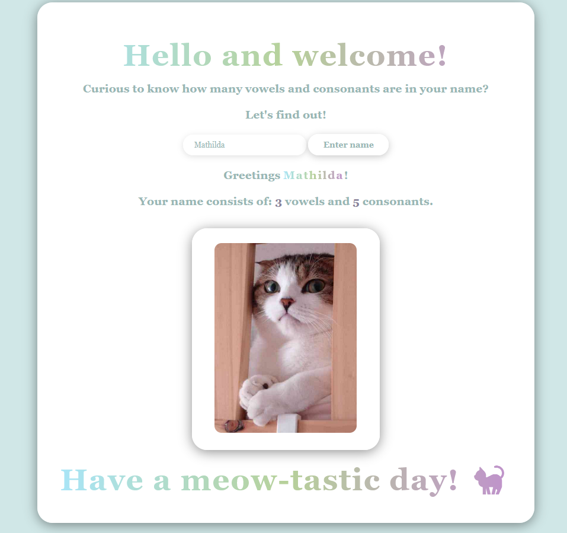

# 1DV610-L1
A simple program where you enter a name, and it counts and displays the number of vowels and consonants. 
A random image of a cat is then displayed.

## How to run the program
Clone or download the project.
Open the project folder in Visual Studio Code.
Install the Live Server extension if you don’t already have it.
Right-click on index.html → select "Open with Live Server".
The program will now run in your default web browser.

## Example Screenshot

### Contact
This project was developed as part of a university course assignment in web programming.

ms228qs@student.lnu.se
